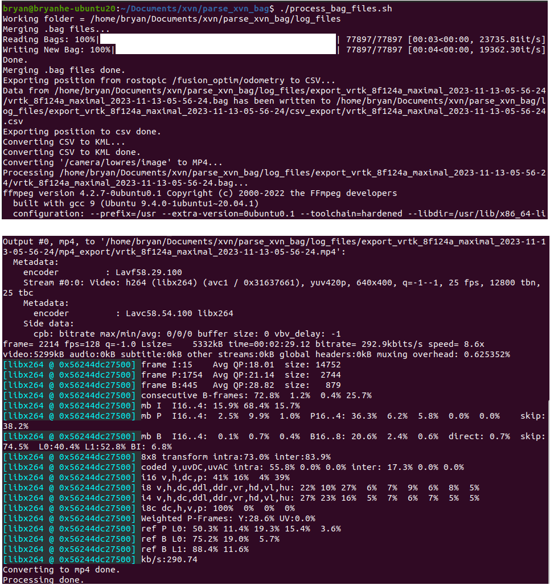

# XVN_Rosbag_Parser
The scripts are used to combine the .bag files from the Xsens Vision Navigator(XVN) .fpz log files, then export the csv(currently only lat, lon, alt), kml, and mp4 files.
ROS NEEDS to be installed in advance.
This is tested with ubuntu 20.04 and ROS Noetic.


## Install the Dependancies:
```
pip3 install simplekml, opencv-python
sudo apt update
sudo apt install ffmpeg
```

## Step 1, Copy files

unzip the .fpz file, copy the two .bag files into the "log_files" folder under the "XVN_Rosbag_Parser" folder

## Step 2, Make the script executable

```
chmod +x process_bag_files.sh
```

## Step 3, run roscore
```
roscore
```


## Step 4, run the script
```
./process_bag_files.sh
```

The files will be generated in the `log_files` folder.



## Step 5, Import the .kml to Google Earth Pro
Launch the Googl Earth Pro(tested in Windows11), "File" - "Import", select the .kml file, then you will be able to see the position trajectory.
